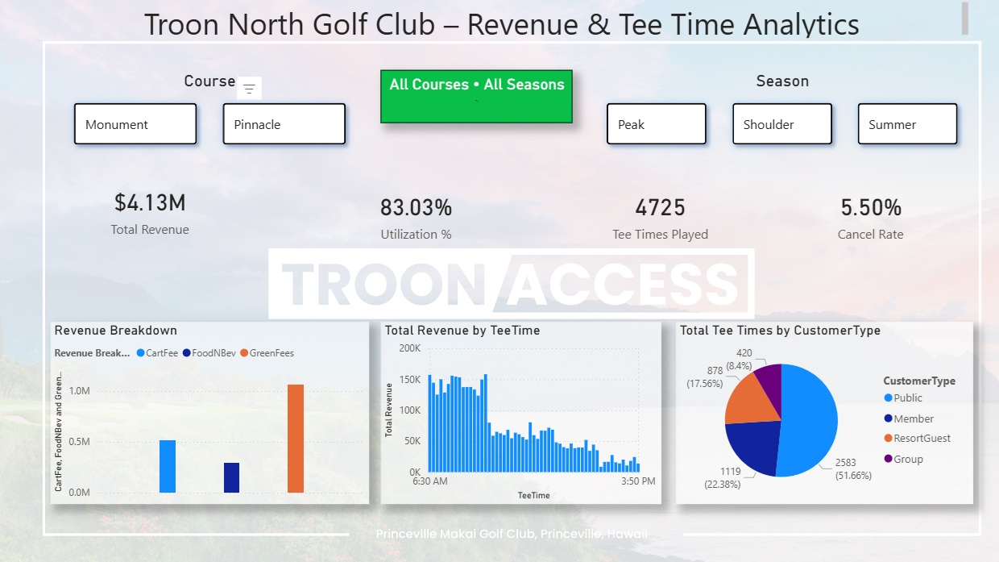
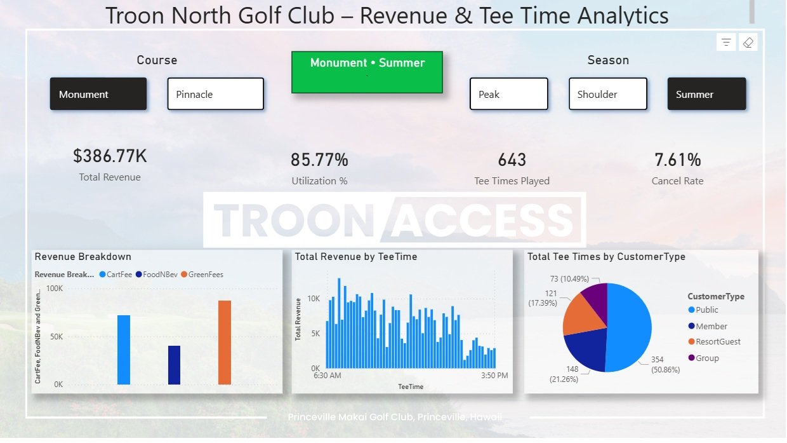
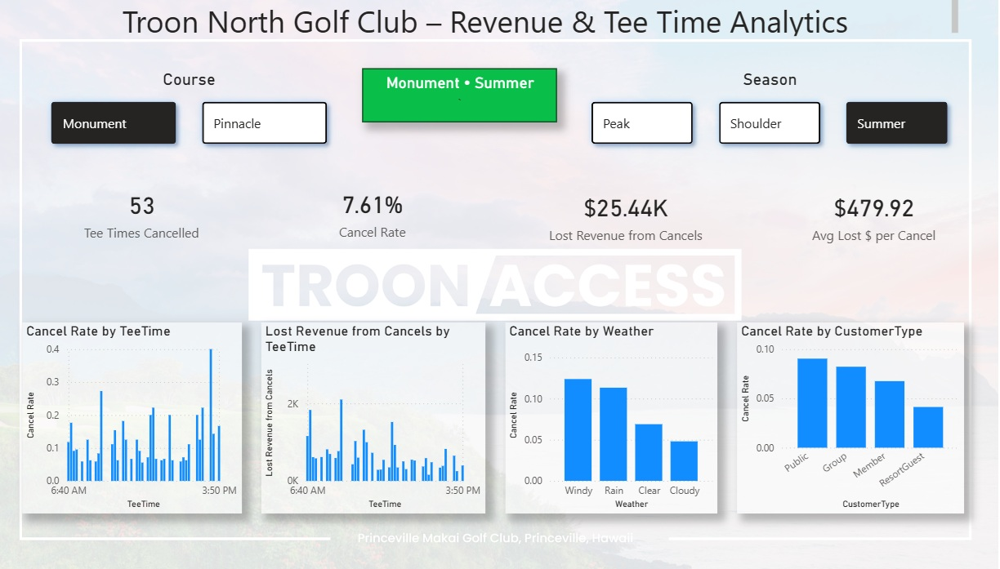

# troon-golf-analytics
## Power BI Dashboard

### Overview – Revenue & Utilization


### Course & Season Drilldown


### Cancellations & Lost Revenue


Power BI project modeling Troon North golf course operations with simulated data, including tee times, revenue, utilization, customer types, and cancellation analysis.
# Troon Golf Analytics

This project simulates real-world golf course operations for Troon North using realistic tee time, revenue, and cancellation data. It was built to demonstrate how Power BI can be used to analyze golf course performance, utilization, and revenue leakage.

The dataset and dashboards model two Troon North courses (Monument and Pinnacle) and include seasonality, time-of-day pricing, customer types, weather, and cancellations.

---

## What this project includes

- A Python data generator that creates realistic Troon-style tee time data
- A CSV dataset designed for direct import into Power BI
- A Power BI dashboard analyzing:
  - Tee time utilization
  - Revenue by course and time of day
  - Cancellation rates and lost revenue
  - Customer segments and booking sources

---

## Files

| File | Description |
|------|-------------|
| `generate_teetime.py` | Python script that generates realistic Troon North tee time and revenue data |
| `TeeTimes.csv` | Sample dataset used in the Power BI dashboard |

---

## How the data works

Each row represents one tee time booking and includes:

- Date and Tee Time
- Course (Monument or Pinnacle)
- Number of players
- Green fee (per player)
- Cart fee (per booking)
- Food and beverage spend
- Total revenue
- Customer type (Public, Member, ResortGuest, Group)
- Booking source (Online, Phone, Concierge, Sales/Events, Walk-up)
- Weather
- Cancellation flag

The data includes realistic seasonality, pricing differences, and cancellation behavior based on weather and time of day.

---

## Power BI Dashboard

You can view the interactive Power BI dashboard here:

**Troon North – Golf Operations Power BI Dashboard**  
https://app.powerbi.com/view?r=eyJrIjoiMTk5OTIyMDItNGMwMC00MjMzLThhMWMtZjY5MDZlODJiYjJkIiwidCI6IjQ3NDYzYWQ4LTkwODktNGIzNC04NjM4LTg2ZWY4NGVhZGZlYiIsImMiOjZ9

---


## How to regenerate the data

If you want to create a new dataset:

```bash
python generate_teetime.py --rows 8000 --start 2025-01-01 --end 2025-12-31 --out TeeTimes.csv --seed 42
